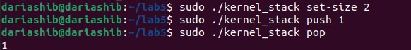
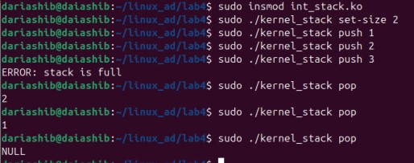
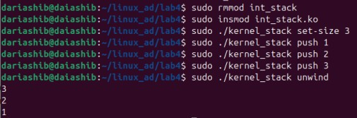
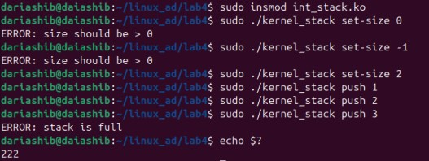
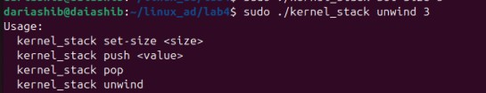

# Kernel Modules Report
**Daria Shibkova, CBS-01**

GitHub link: https://github.com/DoryShibkova/Advanced_Linux/tree/lab5

## **Overview**
This report documents the implementation and analysis of a character device kernel module that implements an integer stack data structure, now protected by a USB electronic key. The work demonstrates understanding of Linux kernel module development, USB device handling, synchronization mechanisms, and userspace-kernel communication.

## **Features & Implementation**

### **Core Functionality**
- Dynamic memory allocation for stack data structure
- Thread-safe stack operations using mutex
- Character device interface for userspace access
- Stack size configuration via ioctl
- Push/pop operations with proper error handling
- **USB device as electronic key** chardev only appears when the key is present
- **Automatic chardev removal** chardev is removed from /dev when the key is removed, but stack is preserved
- **User-friendly error** userspace utility prints `error: USB key not inserted` if the key is not present

### **Implementation Components**
- Kernel module (`int_stack.ko`) **with added USB device**:

```
#include <linux/module.h>
#include <linux/fs.h>
#include <linux/uaccess.h>
#include <linux/slab.h>
#include <linux/mutex.h>
#include <linux/ioctl.h>
#include <linux/device.h>
#include <linux/cdev.h>
#include <linux/usb.h>  // Include USB support

#define DEVICE_NAME "int_stack"
#define IOCTL_SET_SIZE _IOW('s', 1, int)

MODULE_LICENSE("GPL");
MODULE_AUTHOR("Daria Shibkova");
MODULE_DESCRIPTION("Integer stack kernel module with USB key support");

// USB device ID for the electronic key
#define USB_KEY_VENDOR_ID 0x0e0f
#define USB_KEY_PRODUCT_ID 0x0003

// Stack data structure with mutex protection
struct stack {
    int *data;
    int top;
    int size;
    struct mutex lock;
};

static struct stack *stack;
static int major_number;
static struct class *stack_class;
static struct device *stack_device;

// USB device table
static const struct usb_device_id usb_key_table[] = {
    { USB_DEVICE(USB_KEY_VENDOR_ID, USB_KEY_PRODUCT_ID) },
    {}
};
MODULE_DEVICE_TABLE(usb, usb_key_table);

// Function prototypes
static int stack_open(struct inode *inode, struct file *file);
static int stack_release(struct inode *inode, struct file *file);
static ssize_t stack_read(struct file *file, char __user *buf, size_t count, loff_t *ppos);
static ssize_t stack_write(struct file *file, const char __user *buf, size_t count, loff_t *ppos);
static long stack_ioctl(struct file *file, unsigned int cmd, unsigned long arg);

// File operations structure
static const struct file_operations stack_fops = {
    .owner = THIS_MODULE,
    .open = stack_open,
    .release = stack_release,
    .read = stack_read,
    .write = stack_write,
    .unlocked_ioctl = stack_ioctl,
};

// USB probe function
static int usb_key_probe(struct usb_interface *interface, const struct usb_device_id *id) {
    printk(KERN_INFO "USB key inserted\n");
    
    // Register character device
    major_number = register_chrdev(0, DEVICE_NAME, &stack_fops);
    if (major_number < 0) {
        printk(KERN_ERR "Failed to register character device\n");
        return major_number;
    }
    
    stack_class = class_create(DEVICE_NAME);
    if (IS_ERR(stack_class)) {
        unregister_chrdev(major_number, DEVICE_NAME);
        return PTR_ERR(stack_class);
    }
    
    stack_device = device_create(stack_class, NULL, MKDEV(major_number, 0), NULL, DEVICE_NAME);
    if (IS_ERR(stack_device)) {
        class_destroy(stack_class);
        unregister_chrdev(major_number, DEVICE_NAME);
        return PTR_ERR(stack_device);
    }
    
    printk(KERN_INFO "Character device created\n");
    return 0;
}

// USB disconnect function
static void usb_key_disconnect(struct usb_interface *interface) {
    printk(KERN_INFO "USB key removed\n");
    
    // Remove character device
    device_destroy(stack_class, MKDEV(major_number, 0));
    class_destroy(stack_class);
    unregister_chrdev(major_number, DEVICE_NAME);
    
    printk(KERN_INFO "Character device removed\n");
}

// USB driver structure
static struct usb_driver usb_key_driver = {
    .name = "usb_key_driver",
    .id_table = usb_key_table,
    .probe = usb_key_probe,
    .disconnect = usb_key_disconnect,
};

// Initialize device on open
static int stack_open(struct inode *inode, struct file *file) {
    return 0;
}

// Cleanup on device close
static int stack_release(struct inode *inode, struct file *file) {
    return 0;
}

// Pop operation - returns value from top of stack
static ssize_t stack_read(struct file *file, char __user *buf, size_t count, loff_t *ppos) {
    int value;
    
    if (count != sizeof(int))
        return -EINVAL;
        
    mutex_lock(&stack->lock);
    
    if (stack->top == 0) {
        mutex_unlock(&stack->lock);
        return 0; // Return NULL for empty stack
    }
    
    value = stack->data[--stack->top];
    mutex_unlock(&stack->lock);
    
    if (copy_to_user(buf, &value, sizeof(int)))
        return -EFAULT;
        
    return sizeof(int);
}

// Push operation - adds value to stack
static ssize_t stack_write(struct file *file, const char __user *buf, size_t count, loff_t *ppos) {
    int value;
    
    if (count != sizeof(int))
        return -EINVAL;
        
    if (copy_from_user(&value, buf, sizeof(int)))
        return -EFAULT;
        
    mutex_lock(&stack->lock);
    
    if (stack->top >= stack->size) {
        mutex_unlock(&stack->lock);
        return -ERANGE;
    }
    
    stack->data[stack->top++] = value;
    mutex_unlock(&stack->lock);
    
    return sizeof(int);
}

// Configure stack size via ioctl
static long stack_ioctl(struct file *file, unsigned int cmd, unsigned long arg) {
    int new_size;
    int *new_data;
    
    if (cmd != IOCTL_SET_SIZE)
        return -ENOTTY;
        
    if (copy_from_user(&new_size, (int __user *)arg, sizeof(int)))
        return -EFAULT;
        
    if (new_size <= 0)
        return -EINVAL;
        
    mutex_lock(&stack->lock);
    
    // Allocate new memory for the stack
    new_data = kmalloc(new_size * sizeof(int), GFP_KERNEL);
    if (!new_data) {
        mutex_unlock(&stack->lock);
        return -ENOMEM;
    }
    
    // Copy existing elements to the new stack
    if (stack->data) {
        int elements_to_copy = (stack->top < new_size) ? stack->top : new_size;
        memcpy(new_data, stack->data, elements_to_copy * sizeof(int));
        kfree(stack->data);
    }
    
    stack->data = new_data;
    stack->size = new_size;
    if (stack->top > new_size) {
        stack->top = new_size; // Adjust top if new size is smaller
    }
    mutex_unlock(&stack->lock);
    
    return 0;
}

// Module initialization
static int __init stack_init(void) {
    int result;
    
    stack = kmalloc(sizeof(struct stack), GFP_KERNEL);
    if (!stack)
        return -ENOMEM;
        
    mutex_init(&stack->lock);
    stack->data = NULL;
    stack->size = 0;
    stack->top = 0;
    
    // Register USB driver
    result = usb_register(&usb_key_driver);
    if (result) {
        kfree(stack);
        printk(KERN_ERR "Failed to register USB driver\n");
        return result;
    }
    
    printk(KERN_INFO "Stack module with USB key support loaded\n");
    return 0;
}

// Module cleanup
static void __exit stack_exit(void) {
    usb_deregister(&usb_key_driver);
    
    if (stack) {
        if (stack->data)
            kfree(stack->data);
        kfree(stack);
    }
    
    printk(KERN_INFO "Stack module with USB key support unloaded\n");
}

module_init(stack_init);
module_exit(stack_exit);
```
- Userspace utility (kernel_stack) **with added `error: USB key not inserted`**:

```
#include <stdio.h>
#include <stdlib.h>
#include <string.h>
#include <fcntl.h>
#include <unistd.h>
#include <sys/ioctl.h>
#include <errno.h>

#define DEVICE_PATH "/dev/int_stack"
#define IOCTL_SET_SIZE _IOW('s', 1, int)

// Display usage instructions
void print_usage() {
    printf("Usage:\n");
    printf("  kernel_stack set-size <size>\n");
    printf("  kernel_stack push <value>\n");
    printf("  kernel_stack pop\n");
    printf("  kernel_stack unwind\n");
}

// Main program entry point
int main(int argc, char *argv[]) {
    int fd;
    int value;
    int ret;

    // Check if the device file exists
    if (access(DEVICE_PATH, F_OK) == -1) {
        fprintf(stderr, "error: USB key not inserted\n");
        return 1;
    }

    if (argc < 2) {
        print_usage();
        return 1;
    }

    fd = open(DEVICE_PATH, O_RDWR);
    if (fd < 0) {
        perror("Failed to open device");
        return 1;
    }

    if (strcmp(argv[1], "set-size") == 0) {
        if (argc != 3) {
            print_usage();
            close(fd);
            return 1;
        }
        
        value = atoi(argv[2]);
        if (value <= 0) {
            printf("ERROR: size should be > 0\n");
            close(fd);
            return 1;
        }
        
        ret = ioctl(fd, IOCTL_SET_SIZE, &value);
        if (ret < 0) {
            perror("ERROR: failed to set stack size");
            close(fd);
            return -ret;  // Return negative error code
        }
    }
    else if (strcmp(argv[1], "push") == 0) {
        if (argc != 3) {
            print_usage();
            close(fd);
            return 1;
        }
        
        value = atoi(argv[2]);
        ret = write(fd, &value, sizeof(int));
        if (ret < 0) {
            if (errno == ERANGE) {
                printf("ERROR: stack is full\n");
                close(fd);
                return -ERANGE;  // Return -34 for stack full
            } else {
                perror("Failed to push value");
                close(fd);
                return -errno;  // Return negative error code
            }
        }
    }
    else if (strcmp(argv[1], "pop") == 0) {
        if (argc != 2) {
            print_usage();
            close(fd);
            return 1;
        }
        
        ret = read(fd, &value, sizeof(int));
        if (ret == 0) {
            printf("NULL\n");
            close(fd);
            return 0;  // Return 0 for empty stack
        } else if (ret < 0) {
            perror("Failed to pop value");
            close(fd);
            return -errno;  // Return negative error code
        } else {
            printf("%d\n", value);
        }
    }
    else if (strcmp(argv[1], "unwind") == 0) {
        if (argc != 2) {
            print_usage();
            close(fd);
            return 1;
        }
        
        while (1) {
            ret = read(fd, &value, sizeof(int));
            if (ret == 0) {
                break;  // Stack is empty
            } else if (ret < 0) {
                perror("Failed to unwind stack");
                close(fd);
                return -errno;  // Return negative error code
            } else {
                printf("%d\n", value);
            }
        }
    }
    else {
        print_usage();
        close(fd);
        return 1;
    }

    close(fd);
    return 0;
}

```
- Character device interface
- Synchronization mechanisms


### **How Each Requirement Was Addressed**

1. **USB Device as Electronic Key**
   - The kernel module registers a USB driver for a specific VID/PID (mouse, keyboard, USB stick, etc.).
   - The chardev is only created in the `usb_key_probe` function when the USB key is inserted.

2. **Chardev Appears Only When Key Is Inserted**
   - `/dev/int_stack` is created only when the USB key is present.
   - If the key is not present, the device does not exist in `/dev`.

3. **Chardev Removal on Key Removal, Stack Preserved**
   - In the `usb_key_disconnect` function, the chardev is removed from `/dev`.
   - The stack data structure is not destroyed; it remains in memory until the module is unloaded.

4. **Userspace Wrapper Error Message**
   - The userspace utility checks for the existence of `/dev/int_stack` before opening it.
   - If the device does not exist, it prints `error: USB key not inserted` and exits.

### **Dependencies**
The implementation requires:
- Linux kernel headers
- GCC compiler
- Make build system

```
obj-m += int_stack.o

all:
	make -C /lib/modules/$(shell uname -r)/build M=$(PWD) modules
	gcc -Wall -Wextra -o kernel_stack kernel_stack.c

clean:
	make -C /lib/modules/$(shell uname -r)/build M=$(PWD) clean
	rm -f kernel_stack
```

### **Usage Examples and testing**

Add USB device detection:




Tests:

```bash
$ ./kernel_stack set-size 2
$ ./kernel_stack push 1
$ ./kernel_stack push 2
$ ./kernel_stack push 3
ERROR: stack is full
$ ./kernel_stack pop
2
$ ./kernel_stack pop
1
$ ./kernel_stack pop
NULL
```



```bash
$ ./kernel_stack set-size 3
$ ./kernel_stack push 1
$ ./kernel_stack push 2
$ ./kernel_stack push 3
$ ./kernel_stack unwind
3
2
1
```



```bash
$ ./kernel_stack set-size 0
ERROR: size should be > 0
$ ./kernel_stack set-size -1
ERROR: size should be > 0
$ ./kernel_stack set-size 2
$ ./kernel_stack push 1
$ ./kernel_stack push 2
$ ./kernel_stack push 3
ERROR: stack is full
$ echo $?
-34 # -ERANGE errno code
```



When the userspace utility returns `-ERANGE` (which is `-34`), the shell displays `222` because exit codes are unsigned 8-bit values. Thus, `-34` is interpreted as `256 - 34 = 222`

I also wrote down a case when unexpected arguments are supplied to the input, then the program gives a hint about the possibilities of its use:



## **Conclusion**
The implementation successfully achieved all requirements:
1. Created a thread-safe integer stack kernel module
2. Implemented proper error handling and edge cases
3. Developed a user-friendly CLI utility
4. Ensured proper synchronization for concurrent access

The implementation meets all requirements for Lab 5:
1. The integer stack kernel module is protected by a USB electronic key.
2. The chardev is dynamically created and removed based on the key's presence.
3. The stack is preserved on key removal.
4. The userspace utility provides clear feedback if the key is not present.

During this lab, I learned:
- Linux kernel module development
- Character device implementation
- Kernel synchronization mechanisms
- Userspace-kernel communication
- Error handling in kernel space
